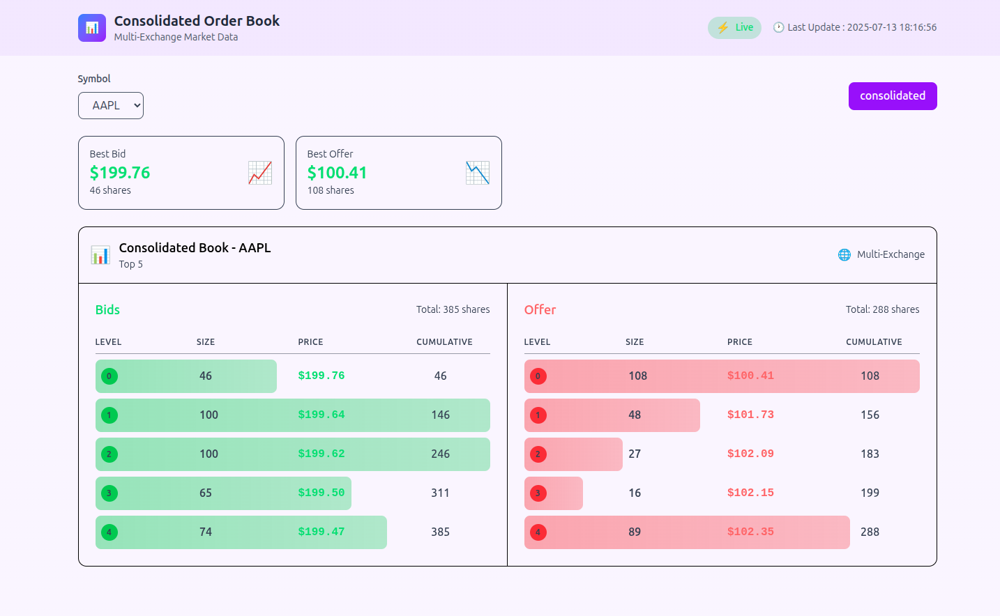

# 🏦 One Big Exchange – Consolidated Order Book

This project simulates receiving market data feeds from **multiple exchanges** and builds a **consolidated order book** per stock symbol.  
It merges data from different exchanges and serves the **top 5 levels** through a FastAPI backend.

✅ This was built as part of an assignment for **CareEco Technologies**.


---

## 📌 **Project Goal**

US equities (or any assets) can be traded on multiple exchanges.  
We want to:
- Merge top-of-the-book and order-based feeds from multiple exchanges
- Build a consolidated order book per symbol
- Serve top 5 levels, showing:
  - Bid Size, Bid Price, Offer Price, Offer Size
- Update live using WebSocket so frontend gets real-time data

---


## ⚙ **How it works**

- We simulate **3 exchanges**: `ExchangeA`, `ExchangeB`, `ExchangeC`
- Each exchange sends two kinds of data feeds:
  #### 1. 📦 Order-based feed:
    - NEW_ORDER (with price, side, quantity)
    - CANCEL_ORDER
    - MODIFY_ORDER
  #### 2. 📊 Top-of-the-book feed:
    - best bid price & size
    - best offer price & size
- The backend:
  - Merges these feeds → same price across exchanges → sum sizes
  - Builds top 5 bid/offer levels, sorted properly
  - Pushes updates over WebSocket to frontend
    
---

## 📊 WebSocket Endpoint 

### Request: 

```ws://<server-ip>:8000/ws/orderbook/{symbol}```

### Response:

```json
{
  "symbol": "SYMBOL",
  "order_book": [
    {
      "level": 0,
      "bid_size": 95,
      "bid_price": 199.11,
      "offer_price": 100.87,
      "offer_size": 62
    }
    // ... more levels
  ],
  "last_updated": "2025-07-11 22:34:10"
}
```

---

## 📦 **Features implemented**

- ✅ Simulate live order-based + top-of-the-book feeds
- ✅ Merge feeds from multiple exchanges into single order book
- ✅ Builds & serves top 5 bid/offer levels, sorted properly
- ✅ FastAPI backend with:
  - WebSocket endpoint for real-time updates
  - Health check endpoint
- ✅ ReactJS frontend:
  - Connects to backend WebSocket for smooth live updates
  - Displays table of top 5 bid/offer levels with real-time refresh
  - Shows last updated timestamp
  - Clean, minimal UI
- ✅ Frontend deployed on Vercel for quick access and modern hosting
- ✅ Dockerized backend, deployed to Render

## ✏ Author
- Murtza Ali
- Md Nadim Uddin
